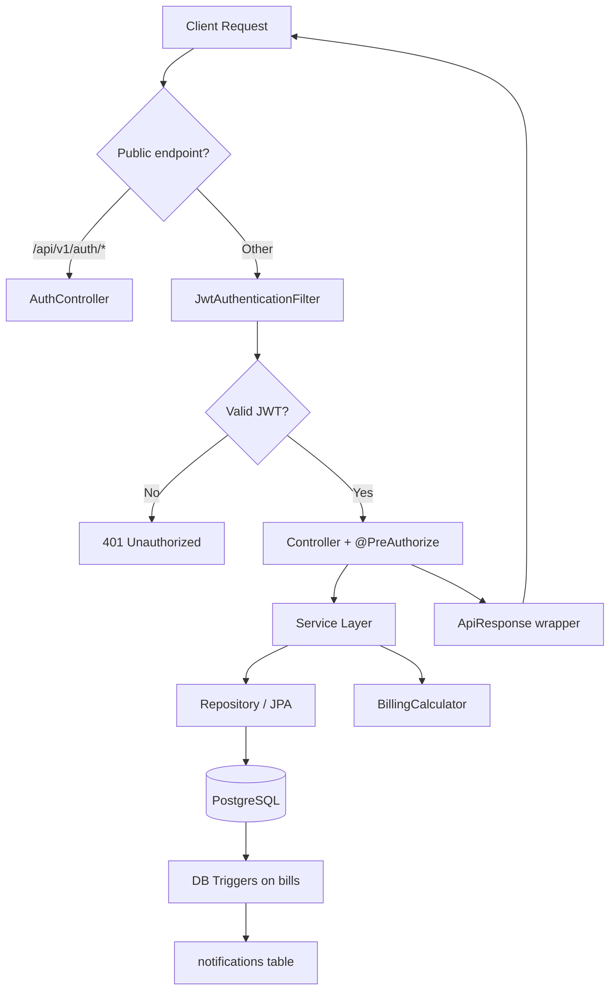

# WASAC/REG Unified Billing System — Architecture

## Entity Relationship Diagram

```mermaid
erDiagram
    USERS ||--o| CUSTOMERS : "ROLE_CUSTOMER linked"
    CUSTOMERS ||--{ METERS : owns
    METERS ||--{ METER_READINGS : has
    METERS ||--{ BILLS : billed_on
    CUSTOMERS ||--{ BILLS : receives
    METER_READINGS ||--|| BILLS : generates
    BILLS ||--{ PAYMENTS : paid_by
    CUSTOMERS ||--{ NOTIFICATIONS : notified
    TARIFFS ||--{ TARIFF_TIERS : contains

    USERS {
        bigint id PK
        string fullName
        string email UK
        string countryCode
        string phoneNumber
        string password
        enum status
        enum role
    }

    CUSTOMERS {
        bigint id PK
        string fullName
        string nationalId UK
        string email UK
        string phone
        string address
        enum status
    }

    METERS {
        bigint id PK
        string meterNumber UK
        enum type
        date installationDate
        enum status
        bigint customer_id FK
    }

    METER_READINGS {
        bigint id PK
        bigint meter_id FK
        decimal previousReading
        decimal currentReading
        date readingDate
        int billingMonth
        int billingYear
    }

    TARIFFS {
        bigint id PK
        string name
        enum tariffType
        enum meterType
        int version
        date effectiveFrom
        decimal flatRate
    }

    BILLS {
        bigint id PK
        string reference UK
        bigint customer_id FK
        bigint meter_id FK
        int billingMonth
        int billingYear
        decimal totalAmount
        decimal balance
        enum status
    }

    PAYMENTS {
        bigint id PK
        bigint bill_id FK
        decimal amount
        enum status
    }

    NOTIFICATIONS {
        bigint id PK
        bigint customer_id FK
        text message
        int month
        int year
    }
```

## Spring Boot Request Flow



## Layered Architecture

```
controller/     REST endpoints, validation, role guards
service/        Business interfaces
serviceImpl/    Business logic, rules enforcement
repository/     Spring Data JPA
entity/         JPA domain model
dto/            Request/response objects
security/       JWT filter, UserDetailsService
config/         Security, OpenAPI, DataLoader, ModelMapper
exception/      GlobalExceptionHandler, custom exceptions
utils/          BillingCalculator (tariff/tax/penalty math)
```

## Key Business Rules

- **Users**: Password 8+ chars with letters, digits, symbols; email is username
- **Customers**: Unique nationalId and email; inactive customers blocked from new meters, readings, and bills
- **Meter readings**: One per meter per month/year; current > previous; meter must be ACTIVE; OPERATOR-only create
- **Tariffs**: Versioned with `effectiveFrom`; billing uses tariff where `effectiveFrom <= period start`
- **Bills**: Generated from readings + active tariff/fixed charge/tax/penalty; unique per meter/period
- **Payments**: Partial or full; finance approves; balance updated; PAID when zero
- **Notifications**: PostgreSQL triggers on bill INSERT and bill status → PAID

## Package

`rw.wasac.reg.billing`

## Database

- Name: `wasac_billing_db`
- DDL: Hibernate `update` mode
- Triggers: `database-triggers.sql` (run after first startup)
