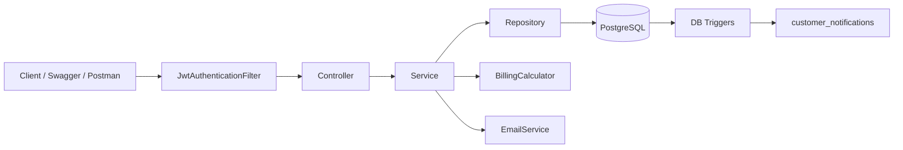
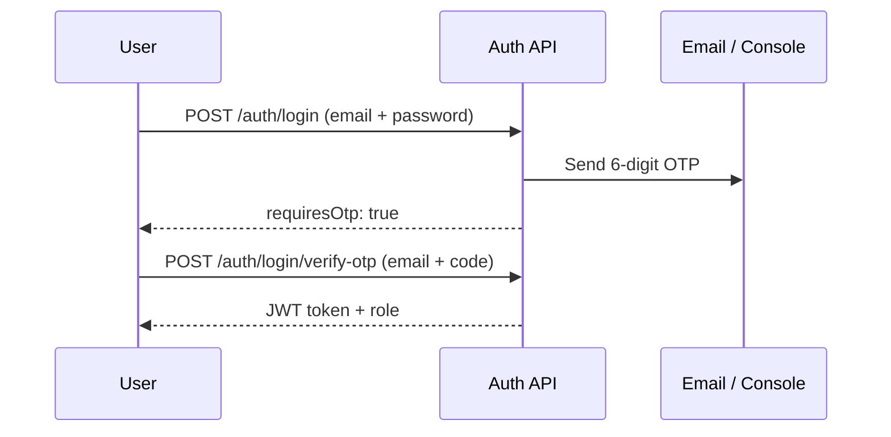
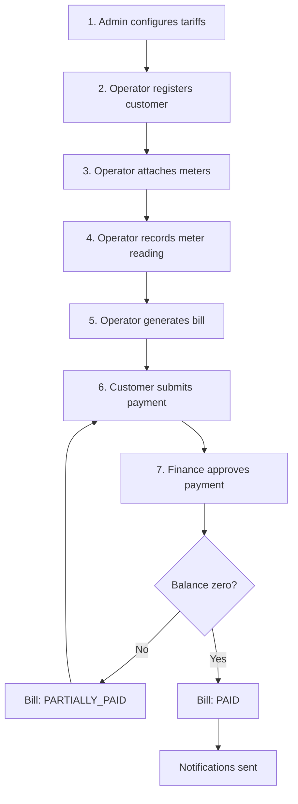

# How the WASAC/REG Unified Billing System Works

This document explains **what the application does**, **how data flows through it**, and **how each role interacts with the system**. It is written for developers, testers, and evaluators who need a clear picture of the backend without reading every source file.

---

## 1. What This Application Is

The **WASAC/REG Unified Utility Billing System** is a **Spring Boot REST API** that automates **postpaid utility billing** for water and electricity customers in Rwanda.

It handles:

- Secure user accounts (JWT + OTP)
- Customer and meter registration
- Monthly meter readings
- Tariff, tax, and penalty configuration
- Bill generation from consumption
- Partial and full payments with finance approval
- Email alerts and in-app notifications (PostgreSQL triggers)
- PDF receipts and operational reports

There is **no frontend** in this project. You interact through **Swagger UI**, **Postman**, or any HTTP client.

| Item | Value |
|------|-------|
| Base URL | `http://localhost:8080` |
| API prefix | `/api/v1` |
| Swagger UI | [http://localhost:8080/swagger-ui.html](http://localhost:8080/swagger-ui.html) |
| Database | PostgreSQL — `wasac_billing_db` |
| Package | `rw.wasac.reg.billing` |

---

## 2. Technology Stack

| Layer | Technology |
|-------|------------|
| Runtime | Java 17 |
| Framework | Spring Boot 3.5 |
| Persistence | Spring Data JPA + Hibernate |
| Database | PostgreSQL 14+ |
| Security | Spring Security + JWT (jjwt) |
| Validation | Jakarta Bean Validation |
| API docs | springdoc-openapi (Swagger) |
| Email | Spring Mail (Gmail SMTP) |
| PDF | OpenPDF |
| Build | Maven |

---

## 3. High-Level Architecture

Every HTTP request follows the same layered path:



### Package layout

```
controller/     REST endpoints, @Valid, @PreAuthorize
service/        Interfaces
serviceImpl/    Business rules and transactions
repository/     Spring Data JPA
entity/         13 JPA tables
dto/            Request & response objects
security/       JWT filter, token provider, UserDetailsService
config/         Security, OpenAPI, DataLoader, ModelMapper
validation/     Custom validators (e.g. Rwanda National ID)
exception/      GlobalExceptionHandler
utils/          BillingCalculator, PDF & email builders
```

### Standard API response shape

All JSON endpoints return a wrapper:

```json
{
  "success": true,
  "message": "Bill generated",
  "data": { }
}
```

Validation errors return `success: false` with field-level messages in `data`.

---

## 4. Security Model

### Public endpoints (no JWT)

- `/api/v1/auth/**` — signup, login, OTP
- `/swagger-ui/**`, `/v3/api-docs/**` — API documentation
- `/actuator/**` — health checks

### Protected endpoints

All other routes require:

```http
Authorization: Bearer <JWT_TOKEN>
```

### Authentication flow (two steps)



**Signup** works the same way: register → verify OTP → account becomes `ACTIVE` → receive JWT.

| Step | Endpoint | Result |
|------|----------|--------|
| Signup | `POST /auth/signup` | User created as `PENDING_VERIFICATION`, OTP sent |
| Activate | `POST /auth/signup/verify-otp` | Account activated, JWT issued |
| Login | `POST /auth/login` | OTP sent if credentials valid |
| Get token | `POST /auth/login/verify-otp` | JWT issued (24h expiry) |

JWT claims include the user's **email** and **role**. Spring `@PreAuthorize` checks roles on each endpoint.

### Roles and responsibilities

| Role | Purpose |
|------|---------|
| **ROLE_ADMIN** | Configure tariffs/taxes/penalties, manage users, full oversight |
| **ROLE_OPERATOR** | Register customers/meters, capture readings, generate bills |
| **ROLE_INSPECTOR** | Capture/void meter readings, view reading reports |
| **ROLE_FINANCE** | Approve or reject payments, view bills and payments |
| **ROLE_CUSTOMER** | View own bills, record payments, download receipts |

Customers are linked to a `Customer` profile via `users.customer_id`. Row-level checks ensure customers only access **their own** bills and PDFs.

---

## 5. Core Domain Model

```mermaid
erDiagram
    USERS ||--o| CUSTOMERS : "optional link"
    CUSTOMERS ||--{ METERS : owns
    METERS ||--{ METER_READINGS : has
    METER_READINGS ||--o| BILLS : generates
    CUSTOMERS ||--{ BILLS : receives
    BILLS ||--{ PAYMENTS : paid_by
    CUSTOMERS ||--{ CUSTOMER_NOTIFICATIONS : notified
    TARIFFS ||--{ TARIFF_TIERS : contains
```

### Key entities

| Entity | Purpose |
|--------|---------|
| **User** | Login account (staff or customer) |
| **Customer** | Utility account holder (NID, phone, address) |
| **Meter** | Water or electricity meter on a customer |
| **MeterReading** | Monthly consumption snapshot |
| **Tariff / TariffTier** | Flat or tiered consumption pricing |
| **FixedCharge, Tax, Penalty** | Additional bill components |
| **Bill** | Monthly invoice with snapshotted amounts |
| **Payment** | Payment attempt against a bill |
| **CustomerNotification** | In-app message (from DB triggers) |
| **Otp** | Email verification codes |

---

## 6. End-to-End Billing Workflow

This is the **main business flow** the system is built around:



### Step-by-step

#### Step 1 — Configure pricing (ADMIN)

Before billing, an admin sets up:

| Config | Endpoint | Example |
|--------|----------|---------|
| Tariffs | `POST /api/v1/config/tariffs` | Flat water rate or tiered electricity |
| Fixed charges | `POST /api/v1/config/fixed-charges` | Monthly service fee |
| Taxes | `POST /api/v1/config/taxes` | VAT 18% |
| Penalties | `POST /api/v1/config/penalties` | Late payment surcharge |

Tariffs are **versioned** with `effectiveFrom` / `effectiveTo`. Billing picks the tariff active for the reading's billing period.

#### Step 2 — Register customer (ADMIN / OPERATOR)

`POST /api/v1/customers`

Stores name, **Rwanda National ID (NIN)**, email, phone, address, and status.

**Rules enforced:**

- National ID must match official **16-digit NIDA format**
- Duplicate national ID or email rejected
- Inactive customers cannot receive new meters, readings, or bills

#### Step 3 — Attach meters (ADMIN / OPERATOR)

`POST /api/v1/meters`

Each meter has a unique number, type (`WATER` or `ELECTRICITY`), installation date, and status.

#### Step 4 — Capture meter reading (OPERATOR / INSPECTOR)

`POST /api/v1/meter-readings`

| Field | Rule |
|-------|------|
| Meter | Must be **ACTIVE** |
| Customer | Must be **ACTIVE** |
| Current reading | Must be **greater than** previous |
| Frequency | **One reading per meter per month/year** |
| Previous reading | Auto-filled from last reading if omitted |

Incorrect readings can be voided with `DELETE /api/v1/meter-readings/{id}` **only if no bill exists yet**.

#### Step 5 — Generate bill (ADMIN / OPERATOR)

`POST /api/v1/bills/generate` with `{ "meterReadingId": <id> }`

The system:

1. Loads the reading, meter, and customer
2. Calculates **consumption** = current − previous
3. Resolves active **tariff**, **fixed charge**, **tax**, and **penalty** for that period
4. Snapshots all amounts on the bill (prices won't change if config changes later)
5. Sets status `PENDING`, balance = total amount
6. Sends email to customer and staff
7. **PostgreSQL trigger** inserts an in-app notification

**Bill formula:**

```
subtotal     = tariffAmount + fixedChargeAmount
taxAmount    = subtotal × tax%
penaltyAmount = subtotal × penalty%
totalAmount  = subtotal + taxAmount + penaltyAmount
balance      = totalAmount − amountPaid
```

Tariff math is handled by `BillingCalculator` (flat rate or tiered blocks).

#### Step 6 — Record payment (ADMIN / FINANCE / CUSTOMER)

`POST /api/v1/payments`

| Field | Rule |
|-------|------|
| billId | Must reference an unpaid bill |
| amount | Must be > 0 and ≤ outstanding balance |
| paymentMethod | `MOBILE_MONEY`, `BANK_TRANSFER`, `CASH`, or `CARD` |
| paymentDate | Cannot be in the future |

Payment is created with status **PENDING** — it does **not** reduce the bill yet.

#### Step 7 — Finance approval (ADMIN / FINANCE)

| Action | Endpoint | Effect |
|--------|----------|--------|
| Approve | `PATCH /api/v1/payments/{id}/approve` | Updates bill balance; may set `PARTIALLY_PAID` or `PAID` |
| Reject | `PATCH /api/v1/payments/{id}/reject` | Payment marked rejected; bill unchanged |

When balance reaches **zero**, bill status becomes **PAID** and a payment confirmation notification is triggered.

---

## 7. Bill and Payment Statuses

### Bill statuses

| Status | Meaning |
|--------|---------|
| `PENDING` | Bill issued, nothing paid yet |
| `PARTIALLY_PAID` | Some payment approved, balance remains |
| `PAID` | Fully settled |
| `OVERDUE` | Defined in enum (reserved for future due-date logic) |

### Payment statuses

| Status | Meaning |
|--------|---------|
| `PENDING` | Awaiting finance approval |
| `APPROVED` | Applied to bill balance |
| `REJECTED` | Declined by finance |

---

## 8. Notifications

The system uses **two notification channels**:

### A. Email (Java layer)

Sent via Gmail SMTP when:

- OTP codes are generated
- Bills are generated
- Payments are submitted, approved, or rejected
- Bills are fully paid
- Staff events occur (new reading, payment queue, etc.)

If SMTP is unavailable, the message is **logged to the console** as `EMAIL FALLBACK -> ...` so you can still test locally.

### B. In-app notifications (PostgreSQL triggers)

After first startup, run:

```bash
psql -U postgres -f database-triggers.sql
```

Triggers on the `bills` table:

| Event | Trigger | Message |
|-------|---------|---------|
| Bill inserted | `after_bill_insert` | *"Dear \<Name\>, Your \<Month/Year\> utility bill of \<Amount\> FRW has been successfully processed."* |
| Bill → PAID | `after_bill_paid` | Payment confirmation message |

Retrieve via `GET /api/v1/notifications` or `GET /api/v1/notifications/customer/{customerId}`.

---

## 9. Reports and PDFs

| Report | Endpoint | Who |
|--------|----------|-----|
| Payment receipt | `GET /api/v1/reports/receipts/payments/{paymentId}` | Admin, Finance, Customer |
| Bill statement | `GET /api/v1/reports/receipts/bills/{billId}` | Admin, Finance, Customer |
| Admin billing summary | `GET /api/v1/reports/admin/billing-summary?month=&year=` | Admin |
| Inspector meter report | `GET /api/v1/reports/inspector/meter-readings?month=&year=` | Admin, Inspector, Operator |

Returns a downloadable PDF file.

---

## 10. Input Validation

All request bodies use **Jakarta Bean Validation** (`@Valid` on controllers). Invalid input returns HTTP **400** with specific field errors.

Examples of validated fields:

| Field | Validation |
|-------|------------|
| National ID | 16-digit Rwanda NIN (NIDA structure) |
| User phone | 9-digit Rwanda mobile (e.g. `788123456`) |
| Customer phone | `+250XXXXXXXXX` or `07XXXXXXXX` |
| Password (signup) | Min 8 chars, letters + digits + symbols |
| IDs in URLs | Must be positive integers |
| Report month | 1–12 |
| Report year | 2000–2100 |
| Bill reference | Format `BILL-XXXXXXXX` |
| Tariff tiers | `toUnits` must exceed `fromUnits` |
| Amounts | Positive decimals with scale limits |

---

## 11. Startup and Seeded Data

On first run (`DataLoader`, non-test profile), the app seeds:

### Default users

| Role | Email | Password |
|------|-------|------------|
| ADMIN | `ruyangearnold@gmail.com` | `Admin@123` |
| OPERATOR | `mwizaelvis@gmail.com` | `Operator@123` |
| INSPECTOR | `inspector@wasac.rw` | `Inspector@123` |
| FINANCE | `jurudoriane@gmail.com` | `Finance@123` |
| CUSTOMER | `customer@wasac.rw` | `Customer@123` |

### Sample data

- Demo customer **Jean Uwimana** with water and electricity meters
- Flat water/electricity tariffs, tiered water tariff, fixed charge, VAT, penalty

---

## 12. How to Run Locally

### Prerequisites

- JDK 17+
- Maven 3.9+
- PostgreSQL 14+

### Setup

```bash
# 1. Create database
psql -U postgres -f database-setup.sql

# 2. Start application (creates tables via Hibernate)
mvn spring-boot:run

# 3. Apply notification triggers (once, after first run)
psql -U postgres -f database-triggers.sql
```

### Quick test path

1. Open Swagger: [http://localhost:8080/swagger-ui.html](http://localhost:8080/swagger-ui.html)
2. Login as `mwizaelvis@gmail.com` → verify OTP → copy JWT
3. Click **Authorize** in Swagger and paste the token
4. Record a meter reading → generate a bill
5. Login as `jurudoriane@gmail.com` → approve a payment
6. Check notifications and PDF receipts

For a detailed step-by-step API walkthrough, see [SWAGGER_CHEATSHEET.md](SWAGGER_CHEATSHEET.md).

---

## 13. API Module Reference

| Module | Base path | Main actions |
|--------|-----------|--------------|
| Auth | `/api/v1/auth` | Signup, login, OTP |
| Users | `/api/v1/users` | Admin user management |
| Customers | `/api/v1/customers` | CRUD, activate/deactivate |
| Meters | `/api/v1/meters` | CRUD, activate/deactivate |
| Meter readings | `/api/v1/meter-readings` | Create, list, void |
| Tariff config | `/api/v1/config` | Tariffs, charges, taxes, penalties |
| Bills | `/api/v1/bills` | Generate, list, lookup |
| Payments | `/api/v1/payments` | Record, approve, reject |
| Notifications | `/api/v1/notifications` | List in-app messages |
| Reports | `/api/v1/reports` | PDF receipts and summaries |

---

## 14. Related Documentation

| File | Contents |
|------|----------|
| [README.md](README.md) | Quick start and prerequisites |
| [ARCHITECTURE.md](ARCHITECTURE.md) | ERD, request flow diagram, business rules |
| [SWAGGER_CHEATSHEET.md](SWAGGER_CHEATSHEET.md) | Full API demo with sample JSON bodies |
| [wasac_erd.html](wasac_erd.html) | Interactive entity-relationship diagram |
| [wasac_flow.html](wasac_flow.html) | Visual system flow |
| [database-triggers.sql](database-triggers.sql) | PostgreSQL notification triggers |

---

## 15. Summary

The WASAC/REG billing backend is a **role-based, JWT-secured postpaid billing engine**. Operators capture consumption, the system calculates bills from versioned tariffs, customers pay through a finance-approved payment workflow, and both **email** and **database triggers** keep customers informed. Everything is exposed as a documented REST API ready for integration with a future frontend or mobile app.
